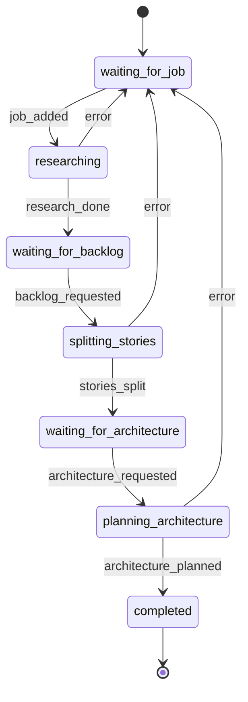

# Development Process State Machine

This document describes the finite state machine (FSM) that controls the development workflow pipeline.

## Overview

The development process follows a linear workflow from research through backlog processing to architecture planning.

## States

- **waiting_for_job**: Initial state, waiting for job to be added via CLI
- **researching**: Deep research using research.sh script
- **waiting_for_backlog**: Waiting for backlog processing
- **splitting_stories**: Split research into user stories
- **waiting_for_architecture**: Waiting for architecture processing
- **planning_architecture**: Plan architecture for user stories
- **completed**: Final state - research completed

## State Diagram

## Events

- **job_added**: Job added to database_queue via CLI
- **research_done**: Research completed successfully
- **backlog_requested**: Backlog processing requested
- **stories_split**: Stories splitting completed
- **architecture_requested**: Architecture processing requested
- **architecture_planned**: Architecture planning completed
- **error**: Error occurred during processing

## Actions

### waiting_for_job
- Check database queue for new jobs

### researching
- Execute: `scripts/research.sh '{topic}' 'prompts/research_prompt.md' '{id}'`
- Timeout: 300 seconds
- Success: triggers `research_done` event

### splitting_stories
- Execute: `scripts/backlog.sh '{research_id}' 'prompts/backlog_prompt.md' '{id}'`
- Timeout: 180 seconds
- Success: triggers `stories_split` event

### planning_architecture
- Execute: `scripts/architecture.sh '{story_id}' 'prompts/architecture_prompt.md' '{id}'`
- Timeout: 240 seconds
- Success: triggers `architecture_planned` event

### completed
- Record completion in database

## Error Handling

Any error during processing transitions back to `waiting_for_job` state, allowing the workflow to restart.