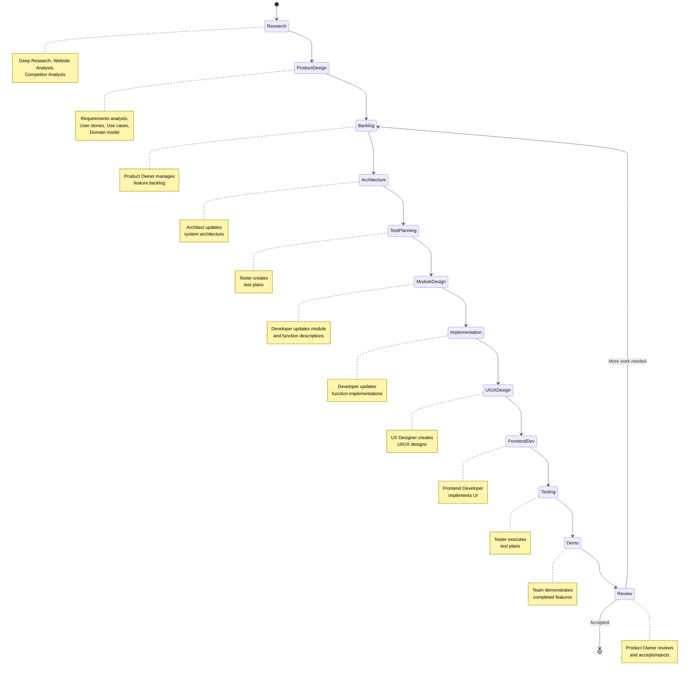

# Development Process

## Overview

The development process is implemented as a state machine where each step represents a specific role and responsibility in the software development lifecycle. The process follows a Kanban-style workflow with clear transitions between states.

## Process Flow



## Initial Steps

### Research Phase
- **Deep Research**: Comprehensive analysis of the domain
- **Website Analysis**: Study existing solutions and patterns
- **Competitor Analysis**: Understand market landscape and best practices

### Product Design Phase
- **Requirements Analysis**: Define functional and non-functional requirements
- **User Stories**: Create user-centered feature descriptions
- **Use Cases**: Document system interactions and workflows
- **Domain Model**: Establish core business entities and relationships

## Development Loop (Kanban)

The main development cycle follows these states:

1. **Product Owner: Backlog**
   - Maintains and prioritizes feature backlog
   - Defines acceptance criteria
   - Manages product roadmap

2. **Architect: System Architecture**
   - Updates system design based on new requirements
   - Ensures architectural consistency
   - Documents technical decisions

3. **Tester: Test Planning**
   - Creates comprehensive test plans
   - Defines test scenarios and cases
   - Establishes quality gates

4. **Developer: Module and Function Descriptions**
   - Updates module documentation
   - Defines function interfaces and contracts
   - Maintains code documentation

5. **Developer: Function Implementations**
   - Implements actual code based on specifications
   - Follows architectural guidelines
   - Ensures code quality standards

6. **UX Designer: UI/UX Design**
   - Creates user interface designs
   - Defines user experience flows
   - Ensures accessibility and usability

7. **Frontend Developer: Frontend Implementation**
   - Implements UI components
   - Integrates with backend services
   - Ensures responsive design

8. **Tester: Testing**
   - Executes test plans
   - Reports defects and issues
   - Validates acceptance criteria

9. **Team: Demo**
   - Demonstrates completed features
   - Gathers feedback from stakeholders
   - Validates feature completeness

10. **Product Owner: Review and Accept**
    - Reviews completed work
    - Accepts or rejects deliverables
    - Decides on next iteration priorities

## State Machine Implementation

Each state transition is implemented as a self-contained script that:
- Validates input conditions
- Performs the required work
- Produces output for the next state
- Updates the database with progress

The state machine ensures that:
- All work follows the defined process
- Each role has clear responsibilities
- Progress is tracked and measurable
- Quality gates are enforced at each step

### Working Implementation

This process has been implemented as a working state machine in this workspace:

- **Engine**: `src/state_machine/engine.py` - Core state machine engine with YAML configuration support
- **Actions**: `src/actions/` - Pluggable action system for each development phase
- **Configuration**: `config/development_process.yaml` - Complete workflow definition
- **Demo**: `config/development_process_demo.yaml` - Auto-completing demonstration version
- **CLI**: `run_process.py` - Command-line interface to execute the process

#### Running the Demo

```bash
# Run the complete development process (auto-completing demo)
python run_process.py --config config/development_process_demo.yaml

# Run with detailed logging
python run_process.py --config config/development_process_demo.yaml --debug
```

The implementation demonstrates each phase of the development process with 1-second sleep actions, showing the complete workflow from research through final acceptance.

#### Key Features

- **Event-driven workflow**: State transitions triggered by completion events
- **YAML configuration**: Complete process defined declaratively
- **Pluggable actions**: Extensible system for implementing actual work
- **Role-based phases**: Each state corresponds to specific team roles
- **Error handling**: Supports process recovery and restart
- **Demonstration mode**: Auto-completing version for easy testing